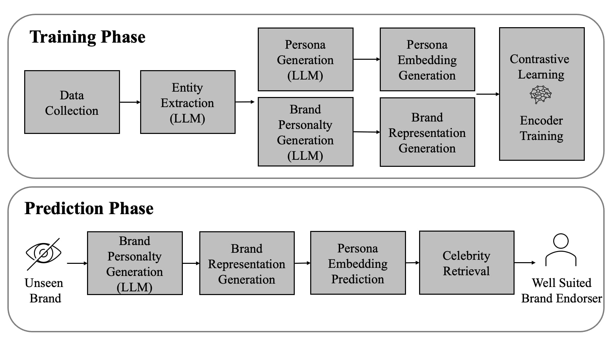
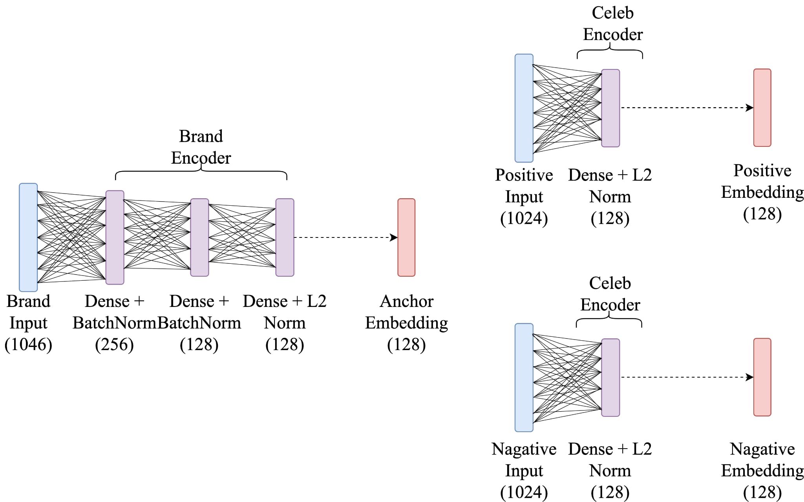

## 📖 介紹 (Introduction)

在品牌行銷中，代言人是連結品牌與消費者的重要橋樑。然而傳統選擇方式多依賴專家經驗與調查，常因主觀性高、成本高昂與結果偏差而影響決策。為解決此問題，我們提出 StarMatch：你的最佳代言人，結合大型語言模型（LLM）、深度學習與對比學習（Contrastive Learning），建立智慧化代言推薦系統。

- 系統流程包含：

LLM 生成品牌與名人描述，結合 Jennifer Aaker 品牌人格五大構面，並透過 Voyage AI Embedding 轉換為特徵向量。再以 Triplet Loss 訓練 Encoder，將品牌與名人向量映射至同一語意空間，捕捉潛在契合度。最終向量存入 Qdrant 資料庫，以支援契合度比對與推薦。

- StarMatch 提供四大功能：
1. 代言人推薦（Top-N 名單與契合度解釋）
2. 視覺化 Dashboard（品牌群聚與趨勢分析）
3. 即時資料更新（新聞爬蟲同步）
4. 決策支持（整合語意與結構化特徵）

- 實驗結果:

 Recall@10 達 65.63%，驗證系統具備實用性與應用價值。

## 🛠️ 方法(Method)

### 1️⃣ 系統架構圖

### 2️⃣ 模型架構圖

## 🎬 影片 (Video)

https://youtu.be/tnKHp7R5xjM

## 🙋‍♀️參與成員 (Member)

### 國立政治大學-資訊科學系

1. 賴映君
2. 王睦閎
3. 陳郁晴
4. 吳岱芸

5. 許博堯

